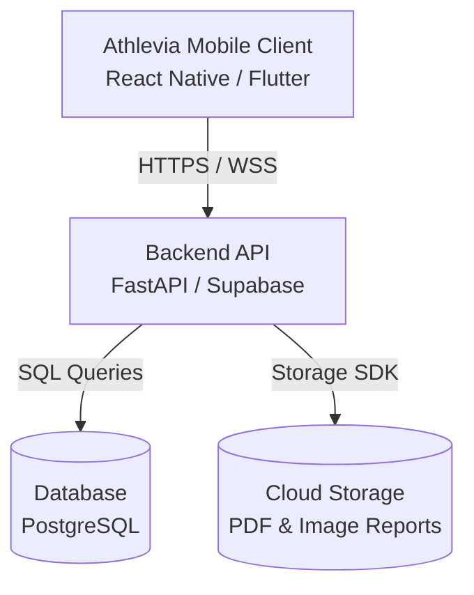

# Athlevia 🏃‍♂️🩺

Athlevia is a premium, cross-platform mobile application designed to seamlessly integrate fitness tracking and health logs into a unified, clean user experience. Compatible with both **iOS** and **Android**, Athlevia helps users take complete control of their physical activity and biological health.

Repository Link: [https://github.com/Sardul-byte/Athlevia-](https://github.com/Sardul-byte/Athlevia-)

---

## 🌟 Core Modules

### 1. 🏋️‍♂️ Fitness Tracking
Track all your workouts in one place with tailored input formats:
- **Gym / Strength Training:** Log custom exercises, sets, repetitions, and weights completed.
- **Cardio (Running, Cycling, Walking):** Map workouts, track routes, track distance, speed, and time.
- **Swimming:** Log swim duration, lap count, and distance.
- **History:** A clean calendar visualization of all past exercises.

### 2. 🩺 Health Hub
Track your baseline health metrics and medical records over time:
- **Vitals Logger:** Track height, weight, blood pressure, and heart rate.
- **Nutrition & Hydration:** Track food intake (calories and macronutrients) and daily water consumption, supported by a barcode/camera scanner to grade food items with a nutrition scoring system.
- **Supplements:** Track daily vitamin intake with custom scheduled reminders.
- **Blood Reports Manager:** Upload laboratory blood test reports, extract biomarker values (e.g., Vitamin D, Cholesterol), and view visual trend lines showing biological changes over time.

---

## 🏗️ Architecture Design

---

## 🗺️ Step-by-Step Roadmap (Monthly Progression)

Athlevia is being built iteratively, step-by-step:

### 📅 Phase 1: Planning & Design (Current)
- [x] Functional requirements analysis.
- [x] Relational database schema design.
- [x] UI/UX navigation flows.
- [x] RESTful API endpoints definition.

### 📅 Phase 2: Mobile Client Setup
- [ ] Initialize mobile repository (React Native + Expo or Flutter).
- [ ] Configure standard Bottom Tab Navigation + Stack Navigators.
- [ ] Create UI style system (colors, typography, spacing).
- [ ] Build static dashboard and settings views.

### 📅 Phase 3: Backend & Database Setup
- [ ] Initialize backend framework (FastAPI or Supabase configurations).
- [ ] Connect database and run migration scripts.
- [ ] Implement user authentication (JWT tokens, sign up/in flow).
- [ ] Set up secure cloud storage bucket for blood reports.

### 📅 Phase 4: Fitness Logging Features
- [ ] Implement active workout tracker with timers.
- [ ] Implement exercise catalog & search.
- [ ] Build set tracking (weight/reps) and workout completion handler.
- [ ] Connect to native storage to persist logs.

### 📅 Phase 5: Health & Nutrition Features
- [ ] Add hydration widget (quick-add buttons).
- [ ] Integrate nutrition intake input logger.
- [ ] Implement camera/barcode scanner integration for food items.
- [ ] Build nutrition scoring system & grade calculation for food items.
- [ ] Develop vitamin checklists and daily reset automation.

### 📅 Phase 6: Vitals, Reports & Analytics
- [ ] Implement weight/height progress trackers with BMI charts.
- [ ] Build blood report file uploader.
- [ ] Implement interactive line charts showing biomarker level trends over time.

---

## 🛠️ Tech Stack Spec (Under Selection)

- **Frontend:** React Native (Expo) or Flutter
- **Backend:** FastAPI (Python) or Supabase (Serverless PostgreSQL)
- **Database:** PostgreSQL
- **Charts:** Native SVG chart libraries
- **Storage:** Amazon S3 / Supabase Storage
