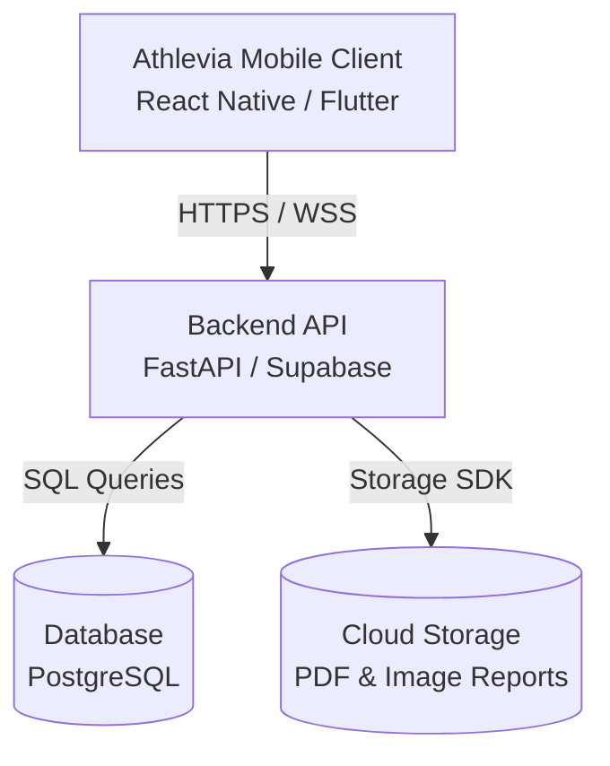

# Athlevia 🏃‍♂️🩺

Athlevia is a premium, cross-platform mobile application designed to seamlessly integrate fitness tracking and health logs into a unified, clean user experience. Compatible with both **iOS** and **Android**, Athlevia helps users take complete control of their physical activity and biological health.

Repository Link: [https://github.com/Sardul-byte/Athlevia-](https://github.com/Sardul-byte/Athlevia-)

---

## 🌟 Core Modules

### 1. 🏋️‍♂️ Fitness Tracking
Track all your workouts in one place with tailored input formats:
- **Gym / Strength Training:** Log custom exercises, sets, repetitions, and weights completed. Includes integrated demonstration videos for exercises to ensure correct form.
- **Cardio (Running, Cycling, Walking):** Map workouts, track routes, track distance, speed, and time.
- **Swimming:** Log swim duration, lap count, and distance.
- **All Sports & Activities:** Track diverse sports and leisure activities (e.g., volleyball, badminton, tennis, basketball, etc.) with custom duration and calorie formulas.
- **AI Coach & Custom Workouts:** Get personalized daily workout plans and automated exercise tracking generated by AI.
- **History:** A clean calendar visualization of all past exercises.

### 2. 🩺 Health Hub
Track your baseline health metrics and medical records over time:
- **Vitals Logger:** Track height, weight, blood pressure, and heart rate.
- **Nutrition & Hydration:** Track food intake (calories and macronutrients) and daily water consumption, supported by a barcode/camera scanner to grade food items with a nutrition scoring system.
- **AI Diet Suggestions:** Receive customized diet recommendations dynamically adjusted based on your logged workouts and activities for the day.
- **Supplements:** Track daily vitamin intake with custom scheduled reminders.
- **Blood Reports Manager:** Upload laboratory blood test reports, extract biomarker values (e.g., Vitamin D, Cholesterol), and view visual trend lines showing biological changes over time.

### 3. 🏆 Perks & Rewards System
Gamify your wellness journey by earning redeemable perks:
- **Goals & Challenges:** Participate in daily/weekly fitness and hydration challenges (e.g., 10,000 steps streak, 8 glasses of water daily).
- **Points & Badges:** Earn custom activity points and unlock achievements for completing logging streaks and workouts. Users can also post their achievements online to share progress.
- **Perk Redemption:** Redeem accrued points directly within the app for specific perks, features, or rewards.

---

## 🎨 Design Principles

Athlevia is built with a focus on:
- **Clean & Intuitive UI:** Streamlined user flows that minimize friction during workout logging and health check-ins.
- **Data Privacy & Security:** Secure, private handling of user biological health records and vital metrics.
- **Gamified Engagement:** Motivational daily streaks, custom achievements, and redeemable rewards to keep users on track.
- **Cross-Platform Fluidity:** A native-feeling, consistent UX/UI experience across both iOS and Android platforms.

---

## 🏗️ Architecture Design



---

## 🗺️ Step-by-Step Roadmap (Monthly Progression)

Athlevia is being built iteratively, step-by-step:

### 📅 Phase 1: Planning & Design (Current)
- [x] Functional requirements analysis.
- [x] Relational database schema design.
- [x] UI/UX navigation flows.
- [x] RESTful API endpoints definition.

### 📅 Phase 2: Mobile Client Setup
- [ ] Initialize mobile repository (React Native + Expo or Flutter).
- [ ] Configure standard Bottom Tab Navigation + Stack Navigators.
- [ ] Create UI style system (colors, typography, spacing).
- [ ] Build static dashboard and settings views.

### 📅 Phase 3: Backend & Database Setup
- [x] Initialize backend framework ([main.py](file:///C:/Users/Sardul/Desktop/Projects/Atlevia%20%28Own%29/main.py) boilerplate).
- [x] Create relational database schema design ([schema.sql](file:///C:/Users/Sardul/Desktop/Projects/Atlevia%20%28Own%29/schema.sql)).
- [x] Connect database via SQLAlchemy ([database.py](file:///C:/Users/Sardul/Desktop/Projects/Atlevia%20%28Own%29/database.py), [models.py](file:///C:/Users/Sardul/Desktop/Projects/Atlevia%20%28Own%29/models.py)).
- [x] Implement user authentication (JWT tokens, sign up/in flow — [security.py](file:///C:/Users/Sardul/Desktop/Projects/Atlevia%20%28Own%29/security.py)).
- [x] Persist workouts, vitals, and nutrition logs through authenticated endpoints.
- [x] Add Alembic migration scripts.
- [x] Set up secure cloud storage bucket for blood reports.

### 📅 Phase 4: Fitness Logging Features
- [ ] Implement active workout tracker with timers.
- [ ] Implement exercise catalog, search, and integrated demo video player.
- [ ] Build set tracking (weight/reps) and workout completion handler.
- [ ] Connect to native storage to persist logs.
- [ ] Integrate AI Coach for custom workout plan generation.
- [ ] Expand the activity registry to support a full catalog of sports (volleyball, badminton, etc.).

### 📅 Phase 5: Health & Nutrition Features
- [ ] Add hydration widget (quick-add buttons).
- [ ] Integrate nutrition intake input logger.
- [ ] Implement camera/barcode scanner integration for food items.
- [ ] Build nutrition scoring system & grade calculation for food items.
- [ ] Build AI Diet Suggestion Engine matching meals to active workouts.
- [ ] Develop vitamin checklists and daily reset automation.

### 📅 Phase 6: Vitals, Reports & Analytics
- [ ] Implement weight/height progress trackers with BMI charts.
- [x] Build blood report file uploader.
- [ ] Implement interactive line charts showing biomarker level trends over time.

### 📅 Phase 7: Perks, Challenges & Rewards
- [ ] Design point-accumulation system database logic.
- [ ] Create gamification modules (achievement badges, daily streaks) with the ability to post achievements online.
- [ ] Implement challenge dashboard and user reward redemption flows.

---

## 🛠️ Tech Stack

- **Frontend:** React Native (Expo) — see [mobile/](mobile/)
- **Backend:** FastAPI (Python) with SQLAlchemy
- **Database:** PostgreSQL
- **Auth:** JWT bearer tokens with bcrypt password hashing
- **Charts:** Native SVG chart libraries
- **Storage:** Amazon S3 / Supabase Storage (pending)

---

## 🚀 Running the Backend Locally

```bash
# 1. Install dependencies
pip install -r requirements.txt

# 2. Configure environment (copy and edit)
cp .env.example .env

# 3. Create the database and apply migrations
psql -U postgres -c "CREATE DATABASE athlevia;"
alembic upgrade head

# 4. Start the API server
uvicorn main:app --reload
```

Schema changes are versioned with Alembic. After editing `models.py`, generate and apply a migration:

```bash
alembic revision --autogenerate -m "describe the change"
alembic upgrade head
```

If you previously created the tables with `schema.sql`, mark the existing database as up to date once with `alembic stamp head` instead of running `upgrade`.

Interactive API docs are available at `http://localhost:8000/docs` once the server is running.
