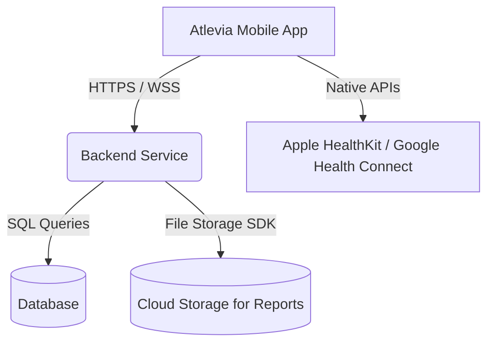

# Atlevia Mobile App Planning

Atlevia is a cross-platform (iOS and Android) mobile application designed to combine fitness tracking and health tracking into a single, cohesive user experience. 

## User Review Required

> [!IMPORTANT]
> **Tech Stack Selection:** Since Atlevia needs to support both iOS and Android, we must choose a cross-platform framework. We recommend **React Native (with Expo)** due to its fast setup, vast ecosystem, and ease of styling, but **Flutter** is also a strong candidate.
> 
> **Backend Architecture:** We need to decide between a custom backend (e.g., **FastAPI** with PostgreSQL) or a backend-as-a-service (e.g., **Supabase** or **Firebase**). Supabase/Firebase will significantly speed up initial development.

## Open Questions

> [!IMPORTANT]
> 1. **Cross-Platform Framework:** Do you prefer **React Native + Expo** (JavaScript/TypeScript) or **Flutter** (Dart)?
> 2. **Backend/Database Preference:** Would you prefer a custom **FastAPI Backend** (since you have FastAPI demo code open) or a backend-as-a-service like **Supabase** (PostgreSQL-based, handles auth, database, and storage easily)?
> 3. **Device Integrations:** Do we need to integrate with native health stores (Apple HealthKit / Google Health Connect) to auto-sync steps, heart rate, and workouts, or will all entries be manual initially?
> 4. **Blood Reports File Storage:** For blood reports, do you want users to just type in values (e.g., Vitamin D: 30 ng/mL) or upload PDF/image reports as files? If uploading, we will need cloud storage configured.
> 5. **Authentication:** Should we support standard Email/Password login, or do we want Social Logins (Google, Apple, etc.) from day one?
> 6. **Food & Barcode Database:** Do you prefer using a free, open-source database like **Open Food Facts** (which supports barcode scanning lookup and provides Nutri-Score grades), or a commercial provider (e.g., FatSecret or Nutritionix)?

---

## Proposed System Architecture

### 1. Functional Sections

#### **A. Fitness Tracking Section**
- **Workouts Log:** Gym sessions (exercises, sets, reps, weight), cycling (distance, time, speed), running, swimming, and custom activities.
- **GPS Tracking:** (Optional/Future) Route tracking for running and cycling.
- **History & Progress:** Calendar view and stats for past workouts.

#### **B. Health Tracking Section**
- **Vital Metrics:** Daily/weekly logs for weight and height (with automatic BMI calculation).
- **Nutrition & Hydration:** Food intake tracking (calories, macros), daily water/vitamin intake logs, and **food scanning (barcode/camera OCR)** linked to a **nutrition scoring/grading system** (e.g., Nutri-Score/NOVA classification).
- **Medical Records:** Blood report logging (storing key biomarker values like cholesterol, vitamins, thyroid, etc.) with PDF/Image attachments.

---

## Verification Plan

Since this is a planning phase, verification will consist of:
- Reviewing and aligning on the answered open questions.
- Agreeing on the data schema and API design.
- Setting up the initial boilerplate once the stack is selected.
